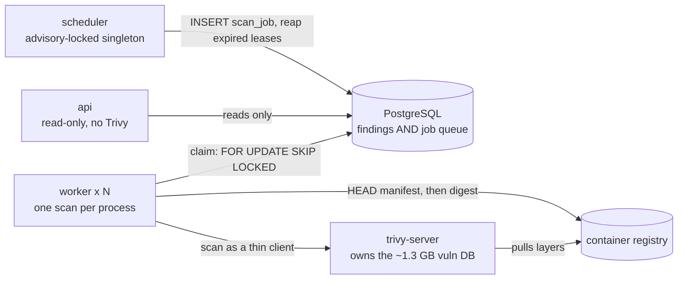
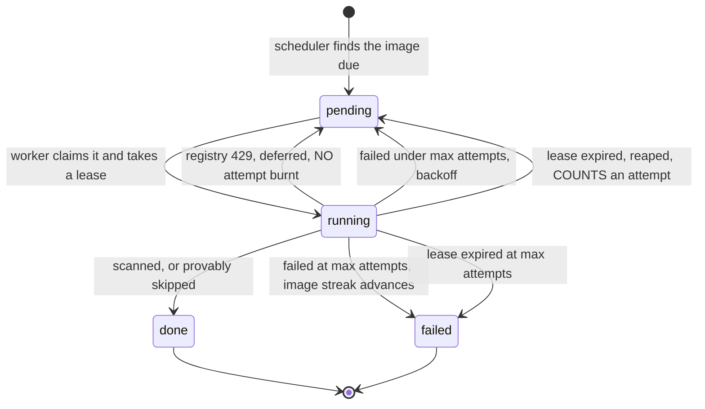

# Container Security Scanner

Scans container images for CVEs with [Trivy](https://github.com/aquasecurity/trivy)
on a schedule, stores the findings in PostgreSQL, and serves them over a REST API.

Built against [the assignment brief](docs/ASSIGNMENT-REQUIREMENTS.md), but designed for the shape
the problem takes at a thousand images rather than ten — which changes several
answers, each explained under [Design decisions](#design-decisions).

---

## Quick start

**Prerequisites:** Docker and Docker Compose. Nothing else — no local Python, no
local Trivy, and no Docker socket is mounted into any container.

```bash
docker compose up --build
```

That brings up Postgres, runs migrations, seeds the brief's ten images, downloads the
Trivy vulnerability database once into a shared volume, and starts the API, the
scheduler, and two workers.

```bash
curl localhost:8000/health
```

Interactive API docs: **http://localhost:8000/docs**

First run downloads the ~1.3 GB Trivy vulnerability database, so allow a couple of
minutes before scanning begins. All ten images are then scanned in roughly five
minutes: every image is due immediately on a cold start, so the queue fills at once
and drains at worker-pool rate, and the first scan of each image pays for a cold
layer pull. Subsequent rounds take seconds per image.

### Watching it work

```bash
# Queue state, live
docker compose exec postgres psql -U scanner -d scanner \
  -c "SELECT j.id, i.name || ':' || i.tag AS image, j.status, j.priority, j.attempts
        FROM scan_job j JOIN image i ON i.id = j.image_id ORDER BY j.id;"

# Scan history, including failures and skips
docker compose exec postgres psql -U scanner -d scanner \
  -c "SELECT i.name || ':' || i.tag AS image, r.status, r.duration_ms,
             left(r.digest, 20) AS digest, r.error
        FROM scan_run r JOIN image i ON i.id = r.image_id
       ORDER BY r.id DESC LIMIT 20;"

# Everything at once: queue depth, skip ratio, scan percentiles, failure reasons
curl -s localhost:8000/api/stats | jq

# One scan's whole lifecycle, across every process that touched it
docker compose logs worker scheduler | grep '"job_id": 41'

# More workers
docker compose up -d --scale worker=6

# Readable logs instead of JSON, if you are tailing them by eye
SCANNER_LOG_FORMAT=text docker compose up
```

---

## Architecture



Four processes over one database. Every arrow into Postgres is the whole coordination
mechanism: there is no broker, no leader election and no service discovery, because
`FOR UPDATE SKIP LOCKED` and `pg_try_advisory_lock` already provide both.

| Service | Role |
|---|---|
| `api` | FastAPI, read-only. **No Trivy in this image** — it stays small and scan load never competes with request latency. |
| `scheduler` | Decides which images are due and enqueues them. Safe to run several replicas: losers of the advisory lock stand by, giving failover without leader election. |
| `worker` | Claims one job, scans, writes, repeats. Synchronous and single-job by design. |
| `trivy-server` | Owns the vulnerability database. Workers scan through it as thin clients — see [the contention measurement](#trivy-runs-in-clientserver-mode-measured-not-assumed). |
| `postgres` | Findings **and** the job queue. |

### The life of a job

Most of this system's subtlety is in which arrow a failure takes, and the three
places an attempt can be counted:



The two shouted edges are the ones that are easy to get wrong, and both were bugs
before they were edges. Backpressure that burns an attempt walks every image to
permanently failed the first time a registry throttles you; a reap that does not
consult `max_attempts` creates a job that can never give up, so a scan that kills its
worker is re-claimed forever. See [retries back off per
image](#retries-back-off-per-image-not-just-per-job).

---

## API

All collection endpoints return `{ "items": [...], "pagination": {...} }` and accept
`limit` (default 100, max 1000) and `offset`. Responses carry `ETag` and
`Last-Modified`; send `If-None-Match` to get a `304`.

### `GET /health`

```bash
curl -s localhost:8000/health | jq
```
```json
{
  "status": "ok",
  "database": "ok",
  "images_enabled": 10,
  "jobs_pending": 3,
  "last_successful_scan_at": "2026-09-14T10:42:07.512Z"
}
```

Reports queue depth and last successful scan, not just connectivity — an API that
answers while no scan has succeeded in hours is not healthy.

### `GET /api/images`

All scanned images with per-severity counts.

```bash
curl -s localhost:8000/api/images | jq
```
```json
{
  "items": [
    {
      "name": "alpine",
      "tag": "3.12",
      "digest": "sha256:c0e9560cda118f9ec63ddefb4a173a2b2a0347082d7dff7dc14272e7841a5b5a",
      "last_scan_at": "2026-09-14T10:41:55.201Z",
      "last_scan_status": "success",
      "scan_interval_seconds": 900,
      "consecutive_failures": 0,
      "total_cves": 4,
      "severity_counts": { "CRITICAL": 0, "HIGH": 2, "MEDIUM": 1, "LOW": 1, "UNKNOWN": 0 }
    }
  ],
  "pagination": { "total": 10, "limit": 100, "offset": 0 }
}
```

### `GET /api/images/{image_name}/{tag}/cves`

CVEs in one image. Optional `?severity=CRITICAL|HIGH|MEDIUM|LOW`.

```bash
curl -s "localhost:8000/api/images/nginx/1.19/cves?severity=CRITICAL" | jq
curl -s "localhost:8000/api/images/bitnami/redis/6.0/cves" | jq   # slashes work
```
```json
{
  "items": [
    {
      "cve_id": "CVE-2021-3711",
      "title": "openssl: SM2 Decryption Buffer Overflow",
      "severity": "CRITICAL",
      "package": { "name": "libssl1.1", "version": "1.1.1d-0+deb10u5", "type": "debian" },
      "fixed_version": "1.1.1d-0+deb10u7",
      "first_seen_at": "2026-09-13T08:15:02.000Z",
      "last_seen_at": "2026-09-14T10:41:55.201Z"
    }
  ],
  "pagination": { "total": 1, "limit": 100, "offset": 0 }
}
```

`fixed_version: null` means no fix has been published — meaningfully different from a
fix that exists but is not applied.

### `GET /api/cves`

Every unique CVE across all images. Optional `?severity=`.

```bash
curl -s "localhost:8000/api/cves?severity=CRITICAL&limit=5" | jq
```
```json
{
  "items": [
    {
      "cve_id": "CVE-2021-3711",
      "title": "openssl: SM2 Decryption Buffer Overflow",
      "max_severity": "CRITICAL",
      "published_at": "2021-08-24T15:15:00Z",
      "last_modified_at": "2022-04-05T18:15:00Z",
      "affected_image_count": 3
    }
  ],
  "pagination": { "total": 41, "limit": 5, "offset": 0 }
}
```

`max_severity` is a **rollup**, not a single vendor's rating — see
[Severity](#severity-belongs-to-the-finding-not-the-cve).

### `GET /api/cves/{cve_id}/images`

Every image affected by one CVE, with the package that carries it.

```bash
curl -s localhost:8000/api/cves/CVE-2021-3711/images | jq
```
```json
{
  "items": [
    {
      "name": "nginx",
      "tag": "1.19",
      "digest": "sha256:df13abe416e37eb3db4722840dd479b00ba193ac6606e7902331dcea50f4f1f2",
      "severity": "CRITICAL",
      "package": { "name": "libssl1.1", "version": "1.1.1d-0+deb10u5", "type": "debian" },
      "fixed_version": "1.1.1d-0+deb10u7",
      "last_seen_at": "2026-09-14T10:41:55.201Z"
    }
  ],
  "pagination": { "total": 3, "limit": 100, "offset": 0 }
}
```

The same CVE may show a **different severity per image** — that is correct, not a
bug. Debian and Alpine rate the same CVE differently.

### `POST /api/images/{image_name}/{tag}/scan` *(beyond the brief)*

```bash
curl -X POST "localhost:8000/api/images/nginx/1.19/scan?time_sensitive=true"
```
```json
{ "status": "queued", "job_id": 42, "time_sensitive": true }
```

`status` is `queued`, `promoted` (a job was already waiting and jumped the lane), or
`already_queued`. Included because without a trigger, the priority lane would be a
column nothing ever sets.

### `GET /api/stats` *(beyond the brief)*

```bash
curl -s "localhost:8000/api/stats?window_hours=24" | jq
```
```json
{
  "generated_at": "2026-09-15T08:36:59.805Z",
  "window_hours": 24,
  "queue": { "pending": 0, "running": 0, "failed": 0, "oldest_pending_age_seconds": null },
  "images": { "total": 10, "enabled": 10, "never_scanned": 0, "failing": 0 },
  "runs": { "success": 10, "failed": 2, "skipped": 8, "skip_ratio": 0.4 },
  "scan_duration_ms": { "count": 10, "p50": 23866, "p95": 87268, "max": 94183 },
  "recent_failures": [
    { "reason": "lease expired; worker presumed dead", "count": 2 }
  ],
  "findings": { "CRITICAL": 95, "HIGH": 769, "MEDIUM": 1188, "LOW": 679, "UNKNOWN": 21 }
}
```

That is a real capture, not an illustration, and it is worth reading as one. The two
failures are the two workers that were restarted mid-scan during this run: their jobs
sat leased until `lease_until` passed, the scheduler reaped both, and the retry
re-scanned the images successfully — the `running → pending` lease-expiry edge in
[the diagram above](#the-life-of-a-job), end to end, visible without opening a log.
The durations are cold: every layer was pulled for the first time, and a steady-state
`p50` is single-digit seconds once the skip path is doing the work.

Every number is a query over rows the scanner already writes — see [the scan history
*is* the metrics store](#the-scan-history-is-the-metrics-store). Three of them are
the ones worth watching:

- **`queue.oldest_pending_age_seconds`** is the backlog signal. `pending` alone rises
  harmlessly at every scheduler tick; this only rises when workers cannot keep up with
  the cadence, and it is the number that says to add replicas. Deferred jobs are
  excluded, so registry backpressure does not masquerade as a worker shortage.
- **`runs.skip_ratio`** should be *high*. It is the content invariant proving work
  unnecessary, and it is where the scan budget is actually saved; a ratio that
  collapses means digests or the vulnerability DB are churning.
- **`scan_duration_ms`** covers successful runs only. A failed run's duration measures
  how long it took to give up and a skipped one never invoked Trivy, so including
  either would make the percentiles say nothing about how long a scan takes.

Unlike the collection endpoints this one is `Cache-Control: no-store`. Their validator
is keyed on the newest scan completion, which is exactly right for findings — they can
only change when a scan completes — but queue depth and backlog age move *between*
scans, so a `304` here would hide the fastest-moving numbers on the page.

---

## Database schema

```
image ──┬──< scan_job          one active job per image, enforced by a partial
        │                      unique index on (image_id) WHERE status IN
        │                      ('pending','running')
        │
        ├──< scan_run          every attempt: success, skipped, or failed
        │                      records digest + trivy version + db version + flags
        │
        └──< finding >── cve
                 │
                 └──── package

```

| Table | Holds |
|---|---|
| `image` | The watch list: `(name, tag)`, optional per-image interval, pointers to the current run and last scan status, and `consecutive_failures` for the per-image backoff. |
| `scan_job` | The queue. Status, priority, `scheduled_for`, `lease_until`, `attempts`. |
| `scan_run` | One row per attempt, with the four fields that form the skip invariant, duration, error, and the per-severity counts that run produced. |
| `package` | `(name, version, type)` — `type` is the ecosystem, so `openssl` as a Debian package and as a Python package are distinct. |
| `cve` | Global CVE facts plus two derived rollups over current findings: `max_severity` and `affected_image_count`. |
| `finding` | The join that matters: a CVE in a package in an image, with **its own severity**, `fixed_version`, and `first_seen_run_id` / `last_seen_run_id`. |

**A finding is "current" iff `finding.last_seen_run_id = image.current_scan_run_id`.**
Every read path filters on this. Findings are never deleted: one that stops being
reported simply stops having `last_seen_run_id` advanced, which preserves the history
that scanning every 15 minutes exists to produce.

Vocabulary is defined in [CONTEXT.md](CONTEXT.md).

---

## Design decisions

### Postgres is the queue

`SELECT … FOR UPDATE SKIP LOCKED`, not Redis or Celery.

A job's completion and the findings it produced **commit in one transaction**. With
an external broker they are two systems, so the only available guarantee is
at-least-once, and the gap gets papered over with idempotency keys. Here there is no
gap.

Redis was the original plan. It lost its justification once the read cache was
dropped: the brief needs queryable scan status and failure history, so the job table
gets written either way — with a broker, job state lives under a TTL and gets
mirrored into Postgres anyway, giving two sources of truth about one job. Throughput
is not the deciding factor in either direction: peak load at 1000 images is about
**1.1 jobs/sec**, roughly three orders of magnitude under what either system handles.

The cost is about 40 lines: an `attempts` column, backoff arithmetic, and a reaper for
expired leases.

### No cold-start jitter, because the queue already absorbs the burst

An earlier version spread never-scanned images across a window with a deterministic
`hash(image_id)` offset. It was removed: **enqueueing is not scanning.**

A thousand due images become a thousand queue rows in one `INSERT`, not a thousand
concurrent scans. Real concurrency is bounded by worker replica count and by the
registry itself, both downstream of the scheduler, so spreading the enqueue changed
nothing a worker, Postgres or `trivy-server` could observe — it only delayed the
first results and gave a manually added image a mystery delay before its first scan.
Steady-state spread is not lost either: it comes from the rate at which the queue
drains, which is what sets each image's `last_scan_at` in the first place.

It also failed to cover the burst that actually happens in production. The jitter
applied only to the never-scanned branch, so after an outage — every image overdue,
`last_scan_at` set — the whole fleet became due on the first tick regardless. If
thundering herd were a real problem here, that is the case worth solving, and the
answer would be clamping catch-up rather than jittering first scans.

### Skip on a content invariant, not elapsed time

A scan is skipped when the **digest, Trivy version, vulnerability DB version, and
scan flags** all match the last successful run. Those four being equal means the
findings are *necessarily* identical.

The obvious alternative — "skip if scanned less than one interval ago" — is wrong in
both directions:

- it **skips scans that would find something**: the vulnerability database updated
  two minutes ago and the image is newly known to be vulnerable;
- it **runs scans that cannot possibly differ**: nothing has changed in three hours.

The check costs one manifest `HEAD`, not a layer pull.

### Images are `(name, tag)`; digests are recorded per run

The API addresses images by tag because the brief does, but a tag is a mutable
pointer. Every `scan_run` records the digest actually scanned, which buys three
things: findings are reproducible, tag drift is observable (new bytes live under a
stable tag is a security event in itself), and the skip invariant above becomes sound.

### Severity belongs to the finding, not the CVE

Trivy reports vendor severity per target, and Debian, Alpine and NVD routinely
disagree about the same CVE. So `finding.severity` is ground truth, and
`cve.max_severity` is a derived rollup so that `GET /api/cves?severity=` has a
defined meaning.

**The rollup rule: a CVE is CRITICAL if it is CRITICAL in any scanned image.** It is
recomputed after every scan over current findings only.

### The registry is the binding constraint — but it is not ours to model

Ten images every fifteen minutes is already a few hundred registry requests per
six-hour window, and registries throttle anonymous clients well below that. At a
thousand images it is not close. That much is right, and it is why a throttled job is
**deferred, not failed**: backpressure must never burn a job's retry allowance, or a
slow afternoon at Docker Hub walks the whole fleet to permanently failed.

The first design drew the wrong conclusion from it. It carried a Postgres token
bucket (`registry_budget`) that modelled Docker Hub's anonymous ceiling locally —
100 requests per six hours — and deferred jobs when the *local* count ran out.

**It was deleted after running it.** Three reasons, ascending:

1. **The constant was a guess at someone else's number.** Docker Hub's anonymous
   limit has changed repeatedly, is scoped per-IP for anonymous clients, and differs
   by authentication state. Any value compiled in here is wrong behind a different
   NAT. The giveaway was the footnote this section used to carry: *"check the current
   figures before tuning."* A limiter whose documentation tells you to go verify its
   central constant against an external source is not a limiter — it is a stale cache
   of a fact we do not own.

2. **It was a second source of truth,** which is precisely the argument made against
   a broker two sections up. The registry holds the authoritative count; we kept a
   divergent local replica and reconciled it with nothing.

3. **It caused a worse outage than the limit it modelled.** This is the one that
   settled it. Left running for three hours, the stack reported:

   ```
   registry-1.docker.io | tokens=0 | capacity=100 | elapsed=02:59:44
   ```

   Ten images at a fifteen-minute cadence need **240** manifest requests per six-hour
   window against a modelled capacity of **100**, so the budget ran dry a third of the
   way in and every job sat `pending` with `registry budget exhausted`. No image was
   scanned for the rest of the window, `/health` still answered `ok`, and the API went
   on serving three-hour-old findings as current. The protection was doing more damage
   than the throttling it existed to prevent — and it was doing it silently, which for
   a security tool is the worst available failure mode.

   Worse, it was charging for something free: Docker Hub counts manifest **GET**s, and
   documents `HEAD` as the way to check your allowance *without* spending it. The skip
   path — 72 of 90 runs on that stack — was paying a toll that does not exist.

**What replaced it is the registry's own answer.** A `429` raises `RateLimited`
carrying the registry's `Retry-After`, and the worker defers for exactly that long.
Trivy's pulls are classified the same way, from stderr, in
[`parser.is_rate_limit_error`](app/scanner/parser.py) — matching on prose is fallible,
so it lives in the fixture-tested module rather than at the subprocess boundary, and
the markers deliberately exclude a bare `429` because layer digests contain those
characters.

Net effect: one table, one module and two config knobs removed, and backpressure is
now driven by the only party that actually knows the limit.

> At a thousand images none of this is sufficient on its own — that workload needs
> ~24,000 manifest requests per window against an anonymous ceiling of ~100. The
> answer there is authentication or a pull-through mirror, not a smarter counter. See
> [Known limitations](#known-limitations).

### Retries back off per image, not just per job

`queue.fail` backs a job off exponentially across its own attempts. That was only
half the problem, and the missing half was invisible until an image was watched for
an afternoon: a *permanently* failed job releases the partial unique index, the
scheduler sees the image is due again one interval later, and enqueues a brand new
job with `attempts = 0` and no memory that the last four hundred attempts all
returned `ImageNotFound`.

So a reference deleted from its registry cost **96 registry requests, 96 `scan_job`
rows and 96 `scan_run` rows a day, forever**, while never surfacing anywhere as
needing attention. The careful reasoning in the worker — *"a reference that does not
exist will not start existing on retry, so burn the allowance immediately"* — was
being undone one layer up.

`image.consecutive_failures` closes it: the wait becomes
`interval × 2^failures`, capped at a day, and any success **or skip** clears the
streak. A dead reference settles at one attempt a day instead of ninety-six.

Two decisions inside that are worth stating:

- **It counts jobs, not attempts.** A job already backs off across its own retries,
  so counting every attempt would let one transient registry blip burn five retries
  in eight minutes and push a perfectly healthy image onto a multi-hour cadence. The
  streak advances only when a job is *exhausted*.
- **It backs off rather than disabling.** Auto-disabling after N failures is the
  obvious move and it is wrong: tags that do not exist today exist tomorrow, and
  recovery should not require a human with a SQL prompt. Backoff keeps the system
  self-healing — measured on a broken image at a 10-second interval, successive
  attempts fell 31s, 50s, 91s apart, and the moment the reference resolved the streak
  went straight back to zero on its own.

`consecutive_failures` is reported on `GET /api/images`, so a rotting entry is
visible rather than merely cheap.

**And a third hole underneath both: the attempt nobody is alive to report.** A worker
killed mid-scan — OOM on a large image, a Trivy crash, an evicted node — never reaches
its own error handling. Its lease simply lapses and the scheduler returns the job to
the queue. That reap used to be free: it incremented `attempts`, but only `queue.fail`
ever compared `attempts` against the limit, and a dead worker never gets there.

So a scan that *kills* its worker was a job that could never give up. It would be
re-claimed forever, taking down one more worker each time, while
`image.consecutive_failures` stayed at zero — because no *job* ever exhausted, the
per-image backoff above never engaged either. Both safety nets were bypassed by the
same gap, and it left no trace: no `scan_run` row, so the one failure with no
surviving reporter was also the one failure with no record.

Reaping now counts against the allowance and writes the attempt through the same
`persist.record_failure` as any other, so a dead worker is bookkept exactly like a
reported one. It lives in the scheduler rather than the workers because it is
administration of a job this process does not own: deciding another worker is dead,
and writing that worker's failure record. That is what the advisory-locked singleton
is for — and keeping it out of the workers stops N of them racing on the same
`UPDATE` every poll.

### Time-sensitive reorders work; it never skips safety gates

A time-sensitive job jumps the priority lane and ignores "not due yet". It still
yields to a registry that is throttling us, and it is still skipped if the content
invariant holds.
Urgency justifies reordering work — never doing provably useless work, and never
getting the IP throttled.

### No read cache

At 1000 images this is roughly 2M finding rows: unremarkable for indexed Postgres,
and the data only changes every 15 minutes. The least cache-friendly endpoint
(`/api/cves/{id}/images`) is precisely the inverted cross-image query a cache serves
worst.

What is avoided is the invalidation surface. A missed invalidation means serving
stale vulnerability data — the one wrong answer a security tool must never give.
`ETag` and `Last-Modified` derived from the newest scan completion give the same
benefit correct by construction, with nothing to go stale.

The validator counts **every** completed run, failures included. Findings only move on
a success, but `GET /api/images` also reports `last_scan_at`, `last_scan_status` and
`consecutive_failures`, and a failed run moves all three. Excluding failures would
hand a revalidating client a `304` carrying `consecutive_failures: 0` for an image
that has started rotting — suppressing precisely the signal that field exists to
raise. A validator is only correct if it covers everything the response can say.

It is one `MAX(completed_at)`, and `scan_run` is the fastest-growing table in the
schema, so it gets its own index: unindexed it is a sequential scan paid on every
request, measured at 129 ms once a thousand-image fleet has a month of history
(2.88 M rows), against 0.6 ms with the index.

### Listing endpoints read rollups; they never aggregate

Both list endpoints have an obvious implementation that aggregates the `finding`
table per request, and both fall over at the scale this is designed for. `GET
/api/images` sums severities per image — ~200,000 rows a page at a thousand images.
`GET /api/cves` asks "is this CVE still found anywhere?" as an `EXISTS` per CVE, which
the planner answers by hashing every current finding in the database.

So each is precomputed by the scan that already knew the answer, and the read becomes
an index lookup. Measured on 1000 images / 2M findings / 20k CVEs:

| | aggregated per request | read from a rollup |
|---|---|---|
| `GET /api/images` (page of 100) | 283 ms | **2.0 ms** |
| `GET /api/cves` — `count(*)` | 1,510 ms | **1.4 ms** |
| `GET /api/cves` — page of 100 | 746 ms | **0.9 ms** |

A covering index was tried first on the CVE path and rejected: 94 MB for a 2.5×
improvement, because the planner still hashes the whole finding table.

**Where each rollup lives, and why:**

- **Per-severity counts live on `scan_run`** — the run that produced them — not on
  `image`. A skipped run never advances `current_scan_run_id`, so the counts stay
  pointing at the run whose findings are current, for free: the skip invariant
  protects them with no extra code. `GET /api/images` was *already* joining that row
  for the digest, so the aggregate query disappears rather than getting faster. It
  also makes "did this image get worse?" a query rather than a diff.
- **`cve.affected_image_count` is maintained by the existing `max_severity`
  recompute** — same `GROUP BY` over current findings, so the second column is free.
  `GET /api/cves?severity=` already trusted `max_severity_rank`, a derived column on
  `cve`, for filtering; this extends a rollup the API depended on rather than
  introducing a new kind of trust.

**Isn't this the invalidation problem the [no-cache](#no-read-cache) section rejects?**
No, and the distinction is the one that section actually rests on. A cache is a second
system with its own lifetime, and a missed invalidation serves stale vulnerability
data. These commit **in the same transaction as the findings they describe** — the
same atomicity argument that makes Postgres the queue. There is no window in which
they can disagree. The schema already denormalises `last_scan_at` and
`last_scan_status` onto `image` for exactly this reason.

Two honest edges:

- **They are `NULL`, not `0`, on a failed or skipped run.** Those produce no finding
  set, and a security tool must never render *we do not know* as *zero
  vulnerabilities*.
- **Deleting an `image` row leaves `affected_image_count` stale until the next scan
  of any image sharing that CVE.** `max_severity` has always had this property, since
  both are recomputed per scan rather than per finding change. Disabling an image —
  the documented operation — is unaffected: its findings are still current, and it
  genuinely still has them.

### …and CVE rows are only written when something changed

The same argument one level down. Every CVE in an image passes through both
`_upsert_cves` and the `max_severity` rollup on every successful scan, and between two
scans fifteen minutes apart essentially none of them have changed: not the
description, not the rollup. Written unconditionally, a rescan rewrites thousands of
rows to the values they already hold.

Eight concurrent scanners over 400 shared CVEs, six rounds each:

| | live rows | dead tuples | table size |
|---|---|---|---|
| unconditional writes | 400 | 38,000 | 2.9 MB |
| written only on change | 400 | **0** | **168 kB** |

So both paths are guarded: a `WHERE` on the `ON CONFLICT DO UPDATE`, and an
`IS DISTINCT FROM` on the rollup. Both are needed — either one alone still rewrites
the row. The `COALESCE` inside the upsert stays load-bearing alongside its guard,
because the guard fires when *any* descriptive field is fillable while the `SET`
touches all four; distributions genuinely report different subsets of those fields for
the same CVE, so a scan supplying only a description must not blank a title an earlier
scan learned.

This was also checked for deadlocks, since two workers finishing images that share
CVEs write overlapping row sets. Neither variant produced one — the cost of the
unguarded version is churn, not contention.

### Trivy runs in client/server mode — measured, not assumed

The first design shared one Trivy cache volume across workers, each running Trivy
standalone. That is wrong, and running it proved it: the vulnerability database is a
single ~1.3 GB bbolt file, and concurrent openers serialise brutally.

| image | 2 workers, shared cache | 3 workers, client/server |
|---|---|---|
| `nginx:1.19` | 116,566 ms | **3,921 ms** |
| `postgres:12` | 94,473 ms | **4,126 ms** |
| `redis:6.0` | 10,141 ms *(uncontended)* | **2,886 ms** |

So `trivy-server` owns the database and workers are thin clients that never open it.
This is what makes "scale = replica count" actually true; with the shared cache it
was false, and quietly so — nothing errored, throughput just collapsed.

Workers still mount the server's cache read-only at `/trivy-db`, but only to read
`db/metadata.json` for the database version that feeds the skip invariant. Reading
that file never touches the bbolt database, so it cannot contend with a scan.

Each worker keeps its *own* writable Trivy cache at `/trivy-cache`, deliberately
container-local. Trivy stores an artifact cache there and it is a bolt database too:
mounting it read-only makes every scan a cold pull (75s vs 3s, measured), and sharing
one between workers recreates the very contention this section is about.

### One scan per process

A wedged Trivy takes down one worker, not every in-flight scan on the box, and it
removes concurrency control from the worker entirely. Scaling is replica count:
`docker compose up --scale worker=N`.

### The scan history *is* the metrics store

There is no Prometheus, no StatsD and no separate time series here, and that is not
an omission. `scan_run` already holds one durable row per attempt — outcome, error,
digest, and wall-clock duration — because the brief's "handle scan failures
gracefully" required queryable history rather than log lines. That table has every
property a metrics backend is usually introduced to provide, and two it does not:
nothing is sampled, and nothing is lost on restart.

So `GET /api/stats` is six SQL queries, not an instrumentation layer. p95 scan time is
`percentile_cont(0.95)` over successful runs; the failure breakdown is a `GROUP BY` on
the exception class, recovered from the `"TypeName: message"` that `persist` already
writes rather than stored a second time.

The decision this really settles is that **there is one source of truth about what
happened to a scan**. A counter incremented next to the row would be a second one, and
the two disagree the first time a transaction rolls back — the same argument that
[keeps the queue in Postgres](#postgres-is-the-queue) and that
[rejected a read cache](#no-read-cache). A `/metrics` endpoint, when something
actually scrapes, is a second *reader* of these queries: about thirty lines, and no
new source of truth.

The counterpart to that honesty: this is a pull-only view with no history of its own.
Nothing here alerts, and `p95` over a window is not a graph over time.

### Logs are events with fields, not sentences

One scan crosses three processes — the scheduler enqueues it, a worker claims and
executes it, the API later serves what it found — and what ties them together is the
job, not any one process's lifetime. So log lines are JSON, and the worker binds
`job_id`, `image` and `digest` into a context variable for the duration of a job:

```json
{"ts": "2026-09-15T08:17:52.271+00:00", "level": "INFO", "service": "worker",
 "logger": "worker", "msg": "scan complete", "job_id": 8, "attempt": 0,
 "image": "mysql:8.0", "digest": "sha256:7dcddc01f13bab2f...",
 "findings": 215, "duration_ms": 78818}
```

`job_id` then returns that scan's whole lifecycle across processes — including the
scheduler's own line if the worker died holding the job:

```json
{"ts": "2026-09-15T08:34:46.611+00:00", "level": "WARNING", "service": "scheduler",
 "logger": "scheduler", "msg": "reaped job: worker presumed dead",
 "job_id": 1, "image": "nginx:1.19", "exhausted": false}
```

The alternative — threading a logger through
`_execute` → `persist` → `queue` — makes every function on the path know about
logging in order to preserve one identifier; correlation is ambient to the work, so it
is stored that way. The unit test that matters is that a bound field does *not*
survive its block: correlation that leaks across jobs is worse than none, because it
attributes one scan's failure to the next image in the loop.

The API is the same mechanism one level up. `X-Request-ID` is honoured if the caller
sends one and generated otherwise, echoed on the response, and attached to the single
access line per request. It also has an error boundary, which it previously did not:
an unhandled exception produced a bare 500 with nothing tying it to the request that
caused it — the one place in this system where a failure left no evidence, which is
the exact thing `scan_run` exists to prevent for scans. The body carries the request id and nothing
else; the traceback goes to the log under that id.

Tracing is deliberately absent rather than half-wired. The interesting part would be
that the process boundary here is not an HTTP call: correlating scheduler to worker
means persisting `traceparent` on the `scan_job` row and resuming the span when the
job is claimed. That is a real design, and it is not worth its dependencies until
something collects the spans.

---

## Configuration

Every setting is a `SCANNER_`-prefixed environment variable (see `app/config.py`).

| Variable | Default | Notes |
|---|---|---|
| `SCANNER_DEFAULT_SCAN_INTERVAL_SECONDS` | `900` | The brief's 15 minutes. Per-image overrides live in `image.scan_interval_seconds`. |
| `SCANNER_SCHEDULER_TICK_SECONDS` | `10` | How often the scheduler looks for due images. |
| `SCANNER_TRIVY_SERVER_URL` | set in compose | Enables client mode. **Required for more than one worker** — see the contention measurement above. |
| `SCANNER_LEASE_SECONDS` | `1200` | After this a claimed job is presumed dead and reclaimed. Must exceed the scan timeout, or a slow scan loses its lease mid-flight and gets duplicated onto another worker — enforced at startup. |
| `SCANNER_MAX_ATTEMPTS` | `5` | Retries before a job is marked failed. A nonexistent image fails immediately. A registry throttling us does not count as an attempt at all. |
| `SCANNER_MAX_FAILURE_BACKOFF_SECONDS` | `86400` | Ceiling on the per-image backoff after repeated failures. A dead reference settles at one attempt a day and still recovers on its own. |
| `SCANNER_PAGE_SIZE_DEFAULT` / `_MAX` | `100` / `1000` | Pagination. |
| `SCANNER_LOG_FORMAT` | `json` | `text` for a readable `docker compose logs`. |
| `SCANNER_LOG_LEVEL` | `INFO` | `DEBUG` also surfaces the per-request access line for `/health`. |

### Adding or retuning images

```sql
INSERT INTO image (name, tag) VALUES ('ghcr.io/acme/api', 'v2');
UPDATE image SET scan_interval_seconds = 300 WHERE name = 'nginx';
UPDATE image SET enabled = false WHERE name = 'mongo';
```

The scheduler picks up changes on its next tick, and a newly added image is due
immediately — it is enqueued on that tick rather than after a delay.

---

## Tests

```bash
pip install -r requirements-dev.txt

pytest                                  # 236 with Postgres; 100 pass/136 skip without
ruff check app tests scripts            # lint
python scripts/check_schema_drift.py    # models vs. the hand-written migration
```

Runs without Docker: 100 tests pass and the 136 database-backed ones skip cleanly.
With Postgres reachable, all 236 run:

```bash
docker compose up -d postgres
SCANNER_POSTGRES_HOST=localhost pytest      # 236 passed
```

The database-backed tests rebuild their own `scanner_test` database from the models
on every session — `create_all` adds missing tables but never missing columns, so
migrating it in place would turn a new column into a wall of `UndefinedColumn` errors
for anyone who had run the suite before. It is a separate database rather than the
running stack's — `queue.claim` takes the globally next due job, so
sharing would have the tests and the live system stealing each other's work.

### Verifying against the brief

```bash
python scripts/verify_requirements.py --wait 900 --with-db
```

Checks the running system against every requirement in
[the brief](docs/ASSIGNMENT-REQUIREMENTS.md), labelling each result with the
requirement it proves (1.1, 2.3, 3.4 …). `--with-db` additionally registers an
unresolvable image to prove failures are recorded rather than swallowed. Exit code 0
means the stated requirements are demonstrably met.

- **`test_persist.py`** covers the three invariants that corrupt results *silently*
  rather than raising: a skip must not advance `current_scan_run_id`; a finding that
  stops being reported stops being current but is never deleted; and `max_severity` is
  a rollup over current findings, recomputed *after* the pointer moves. Each was
  mutation-checked — breaking the invariant in `persist.py` fails these tests, which
  is the only reason to trust them.
- **`test_api.py`** drives all five brief endpoints over `httpx.ASGITransport` against
  real Postgres: severity counts that exclude stale findings, per-image severity
  variance, slash-containing image names, conditional requests, and the 404/400 edges.
- **`test_parser.py`** carries the weight. The subprocess boundary is mocked, so
  every decision Trivy output can force is exercised here: severity variance across
  distros, missing and empty `FixedVersion`, `Results: null`, the zero timestamp
  meaning "unknown", duplicate CVEs at the same package grain, and malformed output.
- **`test_worker.py`** pins the failure policy itself. `run_once` is a dispatch
  table -- each exception a scan can raise routes to defer at no cost, burn one
  attempt, or burn the whole allowance -- and nothing else enforces it. The ordering
  of its `except` clauses is load-bearing in particular: `RateLimited` and
  `TrivyRateLimited` both subclass an exception a later clause catches, so reordering
  them silently converts backpressure into permanent failure. Mutation-checked by
  doing exactly that.
- **`test_scheduling.py`** covers due-time arithmetic, the per-image failure backoff
  and its ceiling, the skip invariant — including the case a time-based heuristic gets
  wrong (fresh vulnerability DB, unchanged image) — and the lease/timeout guard.
- **`test_registry.py`** drives the registry client over `httpx.MockTransport`, so it
  runs offline: reference parsing, the bearer-token challenge, and the throttling path
  that replaced the token bucket — `429` on both the manifest *and* the token
  endpoint, and `Retry-After` in both the delta-seconds and HTTP-date forms.
- **`test_trivy.py`** pins exit-code classification only. Throttling and failure both
  exit 1, and confusing them is silent in both directions.
- **`test_queue.py`** runs against real Postgres, because the queue's behaviour *is*
  PostgreSQL semantics: `SKIP LOCKED` and partial unique indexes. Testing it against
  SQLite would prove nothing.

---

## Known limitations

- **The Trivy subprocess boundary is only thinly tested** — exit-code classification
  is pinned (`tests/test_trivy.py`), because confusing throttling with failure is
  silent in both directions. Argv construction and real process behaviour are not
  covered; `app/scanner/trivy.py` is kept tiny specifically so that surface stays
  trivial.
- **The Trivy fixtures are hand-authored** to the documented schema rather than
  captured from a live run. Re-capture them with
  `trivy image --format json nginx:1.19` before trusting them as a regression
  baseline.
- **`scan_run` and `scan_job` have no retention policy.** Nothing deletes either.
  At a thousand images that is roughly **420 MB of `scan_run` per month** and ~96k
  `scan_job` rows a day. The indexes above keep the queries fast regardless, so this
  is a storage and backup cost rather than a latency one, but it is unbounded and a
  real system would age both out. The trap for whoever does: `finding
  .first_seen_run_id` and `last_seen_run_id` are plain columns, not foreign keys, and
  the API *inner-joins* `scan_run` on them — so naive deletion silently drops findings
  from the API rather than erroring. Any retention must keep every run still
  referenced by a live finding.
- **Registry tokens are not cached.** Each digest resolution costs three requests
  (`HEAD` → 401, token, `HEAD` → 200) where Docker Hub's tokens are valid for ~300s.
  That triples load against the one constraint this design calls binding. A
  per-process TTL cache is the obvious fix and was left out only because it is
  untested guesswork about token lifetimes across registries; authentication (above)
  changes the arithmetic more.
- **Pagination is `limit`/`offset`**, which degrades on deep pages. Result sets here
  top out in the tens of thousands, so keyset pagination is the scale-up path rather
  than a present need.
- **Registry authentication is anonymous only.** Private registries would need
  credentials threaded through `app/registry/digest.py` and into the Trivy
  invocation. This is also the real answer to registry throttling at scale: an
  authenticated account, or a pull-through mirror, raises the ceiling by orders of
  magnitude where tuning a client-side limit cannot.
- **`/api/stats` is a point-in-time view, not a time series.** It answers "what is
  happening now, and over the last N hours" from `scan_run`, which is enough to
  decide whether to add workers. It does not graph, alert, or retain a history of its
  own answers, and there is no distributed tracing — see [the scan history *is* the
  metrics store](#the-scan-history-is-the-metrics-store) for what that buys and what
  it costs.
- **Scaling is replica count**, a consequence of one-scan-per-process. Roughly 1000
  images at a 15-minute cadence implies dozens of worker processes — and at that
  point `trivy-server` becomes the next thing to measure, since every worker scans
  through it.
